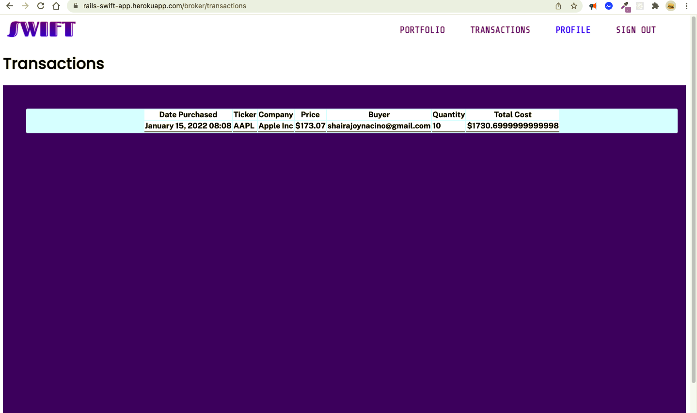

# Swift App

The best trading platform for you!

#### See it live! 
<hr/>

#### Buyer - https://rails-swift-app.herokuapp.com/buyers/sign_in
##### Credentials: 
###### email: jmevillanueva22@gmail.com
###### password: 123123
<hr/>

#### Broker - https://rails-swift-app.herokuapp.com/brokers/sign_in
##### Credentials: 
###### email: taylorswift@gmail.com
###### password: 123123

<hr/>

#### ADMIN - https://rails-swift-app.herokuapp.com/admins/sign_in
##### Credentials: 
###### email: shairajoynacino@gmail.com
###### password: lalalala

<hr/>

### Version

```
  Rails 6.0.3.6
  Nodejs 14.17.1
  Postgres
  Ruby 3.0.2
  Yarn 1.22.4
```

### User Stories

As a Trader, I want to create an account to buy and sell stocks

As a Trader, I want to log in my credentials so that I can access my account on the app
<hr/>


#### As an Admin, I want to create a new user to manually add them to the app.
#### As an Admin, I want to edit a specific user to update his/her details.
#### As an Admin, I want to view a specific user to show his/her details.
#### As an Admin, I want to see all the users that registered in the app so I can track all the users.
<hr/> 


<hr/>

### Extra Features
##### Broker's Page where you can add stock to be bought by buyers




### Testing with Rspec


<hr/>

#### Starting the application

```
  $ rails server
```

