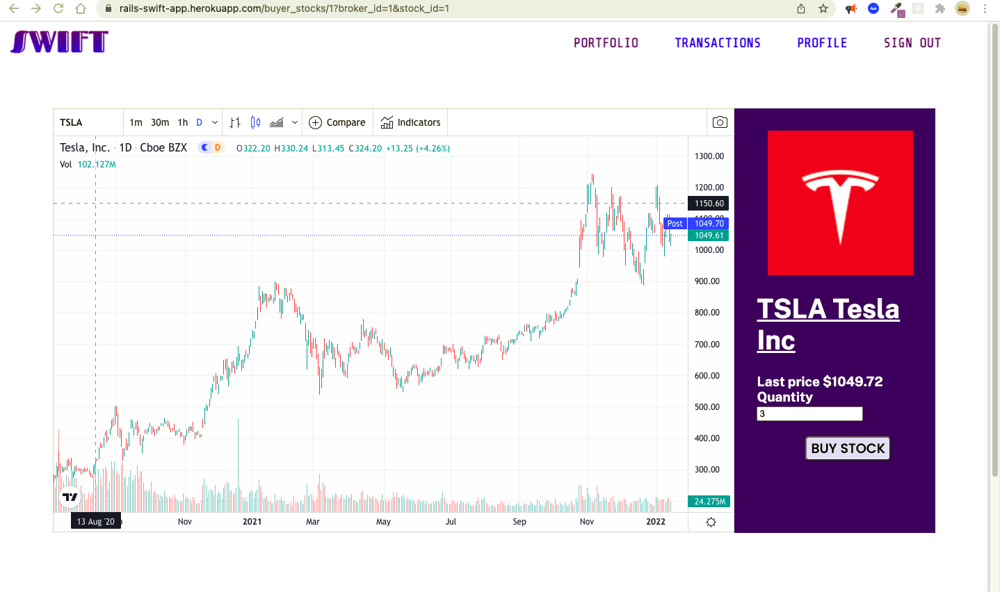

# Swift App

The best trading platform for you!

#### See it live! 
<hr/>

#### Buyer - https://rails-swift-app.herokuapp.com/buyers/sign_in
##### Credentials: 
###### email: jmevillanueva22@gmail.com
###### password: 123123
<hr/>

#### Broker - https://rails-swift-app.herokuapp.com/brokers/sign_in
##### Credentials: 
###### email: taylorswift@gmail.com
###### password: 123123

<hr/>

#### ADMIN - https://rails-swift-app.herokuapp.com/admins/sign_in
##### Credentials: 
###### email: shairajoynacino@gmail.com
###### password: lalalala

<hr/>

### Version

```
  Ruby 3.0.2
  Rails 6.0.3.4
  NodeJS 14.17.1
  Yarn 1.22.4
```

### User Stories

As a Trader, I want to create an account to buy and sell stocks

As a Trader, I want to log in my credentials so that I can access my account on the app
<hr/>





#### As an Admin, I want to create a new user to manually add them to the app.
#### As an Admin, I want to edit a specific user to update his/her details.
#### As an Admin, I want to view a specific user to show his/her details.
#### As an Admin, I want to see all the users that registered in the app so I can track all the users.
<hr/> 


<hr/>

### Extra Features
##### Broker's Page where you can add stock to be bought by buyers


### Testing with Rspec


<hr/>

# API
<hr/>
2 NEWS API's were used in this application:

###### 1. From [https://saurav.tech/]

This API is free and no token is required.

**How the API is called **
1. First, a folder within the *app folder* called *api* was created
2. Inside the *api folder*, a new folder named *Freenews* was created
3. 3 files were made inside the *Freenews folder*:
```
- request.rb
- client.rb
- errors.rb

```
4. Inside the *request.rb file*,
    >require 'rest-client'
    and create Request method
5. Inside the *client.rb file*, create method with two endpoints
6. Go to rails console to see if data is called properly
7. Create controller to have data appear in views


###### 2. From [https://www.marketaux.com/]

This API provides instant access to global stock market and finance news including *funds*, *crypto*, and *comprehensive sentiment analysis*.

This API is free but has a limit of 100 uses per day. An API key is provided after signing up for an account to gain data access.
For unlimited callbacks, the user can subscribe to a paid plan.

The token used in this application is:

```
K2GiBbcezEDuGk5FNtVYAgZovI3boGGQmXRs4KvM

```

**Elements required**
* BASE_URL
* Endpoint
* Token

**Using the API**
1. Create the necessary folders:
  - Under the *app* folder, create a folder named *api*
  - Under the *api folder*, create a folder with a name related to the API. In this case, a folder named *News* was created
2. Create the necessary files:
  - In the *News folder*, 3 files were created:
    *request.rb
    *client.rb
    *errors.rb
3. Create the module and methods
  - In *request.rb* 

    ```
    require 'rest-client'

    module News
    class Request
        BASE_URL = 'https://api.marketaux.com/v1'
        TOKEN = 'K2GiBbcezEDuGk5FNtVYAgZovI3boGGQmXRs4KvM'


        def self.call(http_method:, endpoint:)
            result = RestClient::Request.execute(
                method: http_method,
                url: "#{BASE_URL}#{endpoint}&api_token=#{TOKEN}",
                headers: {'Content-Type'=> 'application/json'}
            )
            JSON.parse(result)
            {code: result.code, status: 'Success', data:JSON.parse(result)}
            rescue RestClient::ExceptionWithResponse => error
            {code: error.http_code, status: error.message, data:Errors.map(error.http_code)}
        end
      end
     end

    ```
  - In *client.rb*: Here the endpoints are used to specify data wished to be called

    ```
    module News
    class Client
        def self.global
            response = Request.call(http_method: 'get', endpoint:'/news/all?countries=global&filter_entities=true&limit=10&published_after=2022-01-10T15:46')
        end

        def self.exchange
            response = Request.call(http_method: 'get', endpoint:'/news/all?exchanges=NYSE&filter_entities=true&limit=10&published_after=2022-01-10T15:37')
        end
      end
    end

    ```

  - In *errors.rb*

    ```
    module News
    class Errors
        def self.map(code)
            case code
            when 401
                return 'Unauthorized request. Please try again.'
            when 404
                return 'Invalid Request'
            else
                return 'Service Unavailable'
            end
        end
      end
    end
    ```
4. Check rails console to test 
5. Create controller to render in views
  * Under the *controllers folder*, create a folder named *api* with the controller file inside

